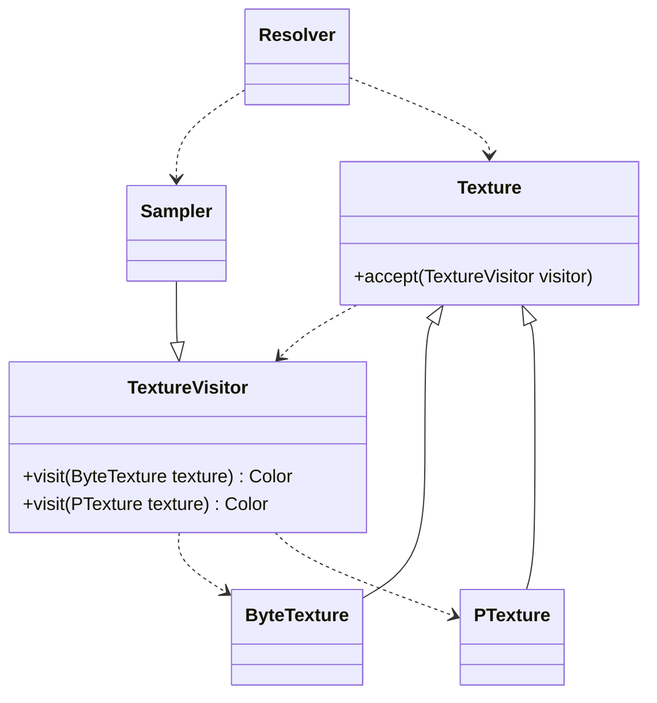

```mermaid
classDiagram

class Texture {
    +accept(TextureVisitor visitor)
}

class TextureVisitor {
    +visit(ByteTexture texture) Color
    +visit(PTexture texture) Color
}

class ByteTexture
class PTexture

class Resolver
class Sampler

Texture ..> TextureVisitor
ByteTexture --|> Texture
PTexture --|> Texture

TextureVisitor ..> ByteTexture
TextureVisitor ..> PTexture

Sampler --|> TextureVisitor
Resolver ..> Sampler
Resolver ..> Texture
```